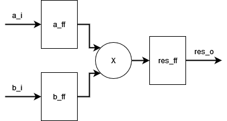
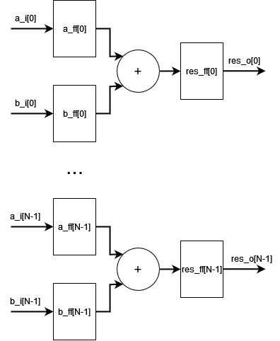

# Лабораторная работа 3. DSP-ячейки

В данной лабораторной работе мы изучим DSP-ячейки в FPGA Xilinx 7, их структуру и функциональность, а также научимся использовать эти ячейки в своей логике.

## DSP ячейки в FPGA Xilinx 7
Упрощённая структурная схема DSP ячейки представлена на рисунке:


DSP ячейка состоит из:
 * Умножителя разрядностью 25 x 18 бит (25x18 multiplier)
 * Предварительного сумматора (pre-adder)
 * Блока АЛУ, способного работать в режиме SIMD
 * Определителя паттернов (pattern detector)
 * Регистр-аккумулятор шириной 48 бит
 * Промежуточных регистров
 * Мультиплексоров данных

> На самом деле структура DSP ячейки несколько сложнее. В частности, DSP ячейка включает в себя дополнительную логику цепочек переноса, предназначенную для каскадирования нескольких ячеек и реализации более сложных вычислительных алгоритмов. Вы можете подробнее изучить структуру DSP ячейки, обратившись к [документации на неё](https://docs.xilinx.com/v/u/en-US/ug479_7Series_DSP48E1).

## Использование DSP

Существует два способа использовать DSP ячейки в своей логике:
 * Использовать примитив `DSP48E1`. Можно использовать библиотечные элементы по аналогии с тем, как мы использовали LUT/FF/CARRY4 в лабораторной работе 2. Использование DSP ячейки таким образом даёт полный контроль над всеми её функциями и возможностями, но ухудшает общую читаемость кода и усложняет любые правки и модификации. Прочитать про примитив `DSP48E1` можно в [документации](https://docs.xilinx.com/v/u/en-US/ug479_7Series_DSP48E1).
 * Альтернативным способом использовать DSP ячейки является написание логики на HDL так, чтобы эта логика естественным образом "ложилась" на существующие в DSP ячейках аппаратные структуры. В этом случае САПР автоматически будет использовать DSP ячейки при синтезе. Такой подход даёт понятный и читаемый код, который не зависит от специфичных для Xilinx библиотечных элементов, пусть и ценой потери полного контроля над происходящим внутри DSP ячейки.

В данной лабораторной работе мы будем придерживаться второго подхода. Любознательный читатель может самостоятельно изучить использование примитива `DSP48E1`, руководствуясь документацией.

Рассмотрим примеры использования DSP ячеек, предоставленные непосредственно Xilinx (взяты, с некоторыми модификациями, из Language Templates).

### Умножение без DSP
В общем случае, САПР Vivado пытается использовать аппаратный умножитель всегда, когда разработчик не запретил это делать.

Управлять использованием аппаратных умножителей можно с помощью директивы `(* use_dsp = "no" *)` в начале модуля:

```verilog
(* use_dsp = "no" *)
module mult_no_dsp
#(
  parameter A_WIDTH = 25,
  parameter B_WIDTH = 18,
  parameter R_WIDTH = A_WIDTH + B_WIDTH
)
(
  input  logic                      clk_i,
  input  logic                      rst_i,
  input  logic signed [A_WIDTH-1:0] a_i,
  input  logic signed [B_WIDTH-1:0] b_i,
  output logic signed [R_WIDTH-1:0] res_o

);

  logic signed [A_WIDTH-1:0] a_ff;
  logic signed [B_WIDTH-1:0] b_ff;
  logic signed [R_WIDTH-1:0] res_ff;
  logic signed [R_WIDTH-1:0] mult;

  always_ff @(posedge clk_i) begin
    if (rst_i) begin
      a_ff <= '0;
      b_ff <= '0;
    end
    else begin
      a_ff <= a_i;
      b_ff <= b_i;
    end
  end

  assign mult = a_ff * b_ff;

  always_ff @(posedge clk_i) begin
    if (rst_i)
      res_ff <= '0;
    else
      res_ff <= mult;
  end

  assign res_o = res_ff;

endmodule
```
Файл с данным примером можно найти [по ссылке](./examples/01_mult_no_dsp/mult_no_dsp.sv).

Данный пример описывает модуль, показанный на схеме ниже. При этом важно понимать, что умножение в данном случае будет выполнено с помощью LUT, а регистры будут использованы из состава Slice. 




### Умножение с DSP

Для того, чтобы использовать аппаратный умножитель DSP ячейки, достаточно убрать из предыдущего примера запрещающую директиву `(* use_dsp = "no" *)`.

Файл с данным примером можно найти [по ссылке](./examples/02_mult_dsp/mult_dsp.sv).

Обратите внимание на то, что этот пример целиком укладывается в одну DSP ячейку, туда помещаются как умножитель, так и входные и выходные регистры. Важное замечание касательно регистров - **в DSP ячейку могут быть помещены только регистры с синхронным сбросом**. Регистры с асинхронным сбросом будут вынесены наружу в виде регистров Slice.

### Асинхронное умножение

В рассмотренных ранее примерах мы использовали регистры для промежуточного хранения входных и выходных данных. В общем случае, это не обязательно, что и демонстрирует данный пример. В нём реализуется схема, показанная на рисунке.


```verilog
module mult_dsp_async
#(
  parameter A_WIDTH = 25,
  parameter B_WIDTH = 18,
  parameter R_WIDTH = A_WIDTH + B_WIDTH
)
(
  input  logic signed [A_WIDTH-1:0] a_i,
  input  logic signed [B_WIDTH-1:0] b_i,
  output logic signed [R_WIDTH-1:0] res_o
);

  assign res_o = a_ff * b_ff;

endmodule
```

Файл с данным примером можно найти [по ссылке](./examples/02_mult_dsp/mult_dsp_async.sv).

### Предварительное сложение

В DSP ячейку встроен аппаратный сумматор "Pre Adder", позволяющий не только выполнить умножение, но и просуммировать два числа, а сумму подать на один из входов умножителя.

Пример реализует схему, показанную на рисунке.


Вычисляемая формула выглядит как `res = (a + c) * b`

```verilog
  assign mult = (a_ff + c_ff) * b_ff;
```

Файл с данным примером можно найти [по ссылке](./examples/03_pre_adder/pre_adder.sv).

### Умножение с накоплением

Ещё более интересным примером использования DSP ячейки является реализация умножения с накоплением. Умножение с накоплением является основой целого ряда математических алгоритмов, в особенности, связанных с ЦОС.

Пример реализует схему, показанную на рисунке. Необходимо понимать, что в этом примере для суммирования-накопления используется АЛУ DSP ячейки, в то время как в предыдущем примере использовался предварительный сумматор. То есть в теории можно уместить в рамках одной DSP ячейки оба примера одновременно, так как они используют разные аппаратные ресурсы для сложения.


В приведенном фрагменте кода можно увидеть, как формируется петля, через которую предыдущее значение регистра `res_ff` складывается с результатом умножения. При этом сигнал `mac_res` представляет из себя выход мультиплексора, который коммутирует `res_ff` или `0`, таким образом, предоставляя возможность сбросить накопленное значение и начать накопление заново.

```verilog
  assign mult = a_ff * b_ff;

  assign mac_res = clear_i ? '0
                           : res_ff;

  always_ff @(posedge clk_i) begin
    if (rst_i)
      res_ff <= '0;
    else
      res_ff <= mac_res + mult;
  end
```
Файл с данным примером можно найти [по ссылке](./examples/04_mult_accumulate/mult_accumulate.sv).

### SIMD в АЛУ

АЛУ в DSP ячейке интересен тем, что способен выполнять целый ряд логических и арифметических операций. В частности, для арифметических операций возможно задействование механизма SIMD, то есть разбиение одного АЛУ на 2 или 4 "виртуальных", каждый шириной по 24 или 12 бит соответственно.
Задействование режима SIMD производится с помощью директивы `(* use_dsp = "simd" *)`, без этой директивы Vivado будет пытаться использовать LUT/Slice.

Пример реализует схему, показанную на рисунке, по сути, это просто несколько параллельных сумматоров.



Файл с данным примером можно найти [по ссылке](./examples/05_alu_simd/alu_simd.sv).

### Обнаружитель паттернов

Последним блоком DSP ячейки, который мы изучим в рамках данного занятия, будет обнаружитель паттернов. На самом деле это просто хитрый компаратор, который смотрит на выход DSP ячейки и позволяет реализовывать целый ряд полезных операций, таких как обнаружение переполнения или округление чисел. Мы разберём самый простой пример, сравнение выходного сигнала с некоторой константой.

Пример реализует схему, показанную на рисунке.


Файл с данным примером можно найти [по ссылке](./examples/06_pattern_detect/mult_compare.sv).

Сравнение чисел операцией `==` вам уже должно быть знакомо и затруднений представлять не должно.

```verilog
  localparam signed [42:0] CMP = 1235678;

  always_ff @(posedge clk_i) begin
    if (rst_i)
      match_ff <= '0;
    else
      match_ff <= mult == CMP;
  end
```

## Задание лабораторной работы

Для успешной защиты лабораторной работы вам необходимо выполнить все пункты задания и внятно ответить на все вопросы.

1. Воспроизведите примеры "Умножение без DSP" и "Умножение с DSP".
   * Проведите синтез обоих примеров и сравните Utilization. Почему пример "без DSP" использует LUT, а пример "с DSP" не использует их? Откройте Synthesis > Schematic для обоих примеров и объясните увиденное.
   * Увеличьте разрядность одного или сразу двух входов в примере "Умножение с DSP". Откройте Synthesis > Schematic и объясните увиденное.
   * Почему в примере "Умножение с DSP" на схеме Synthesis > Schematic отсутствуют регистры? Куда они пропали и где находятся?
   * В примере "Умножение с DSP" поменяйте тип сброса на асинхронный. Что случилось с регистрами на схеме Synthesis > Schematic? Почему?
   * Подключите файл [clk.xdc](./examples/02_mult_dsp/clk.xdc) к проектам с примерами "Умножение без DSP" и "Умножение с DSP" и выполните сравнительный анализ тактовой частоты. **Внимание! Для примера "Умножение с DSP" используйте top-level модуль-обёртку [mult_dsp_wrapper.sv](./examples/02_mult_dsp/mult_dsp_wrapper.sv).** Какие получились тактовые частоты у разных примеров? Почему они отличаются?
   * Если вы не знаете как посчитать тактовую частоту, обратитесь [к инструкции](../../Other/Vivado%20STA/README.md)
2. Воспроизведите пример "Предварительное сложение".
   * Откройте Synthesis > Schematic. Почему на схеме не видно сумматора, который появился в этом примере?
   * С помощью какого элемента DSP ячейки реализовано сложение в данном примере?
3. Воспроизведите пример "Умножение с накоплением"
   * Что в этом примере делает сигнал `clear_i`?
   * С помощью какого элемента DSP ячейки реализовано сложение в данном примере?
4. Воспроизведите пример "SIMD в АЛУ"
   * Измените параметр `W` на 20. Откройте схему Synthesis > Schematic. Что поменялось? Почему?
5. Воспроизведите пример "Обнаружитель паттернов".
   * Для чего может быть использован обнаружитель паттернов?
